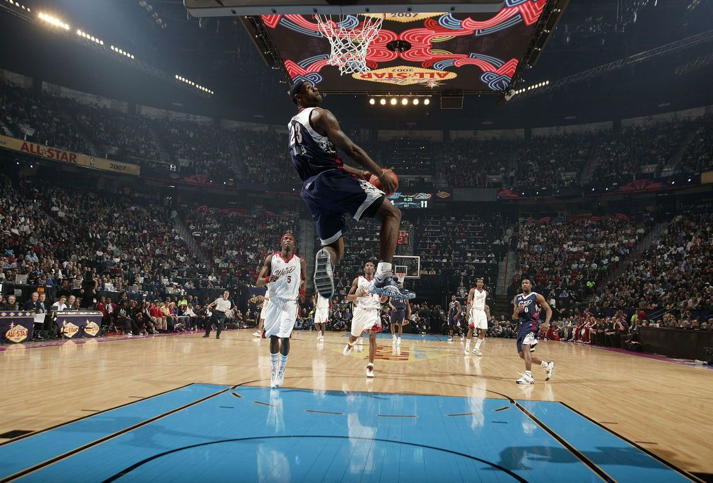
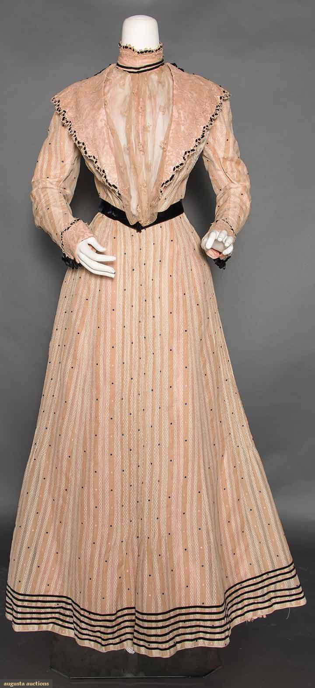

 # The Dream Team

HARD WORK PAYS OFF, DREAM BIG AND BELIVE IN YOURSELF!!

## TM1 Mirdan Assi:

From: Iraq

Hobbies: Baskitball, soccer, gym, boxing

Goals: Graduate, become a UX designer, buy a sport car

Likes: Drawing, joking, playing video games, going to the beach

## TM2 Leila Akbari:

From: Iran

Hobbies: Fashion, dancing, skating

Goals: Graduate, buy a house, Open her own busniess

Likes: Drawing, cooking, makeup, shopping

## Contributing

1. Fork it!
2. Create your feature branch: `git checkout -b my-new-feature`
3. Commit your changes: `git commit -am 'Add some feature'`
4. Push to the branch: `git push origin my-new-feature`
5. Submit a pull request :D

## History

October 1st, 20222

## Credits

Mirdan Assi, Leila Alkbari

## License

MIT
